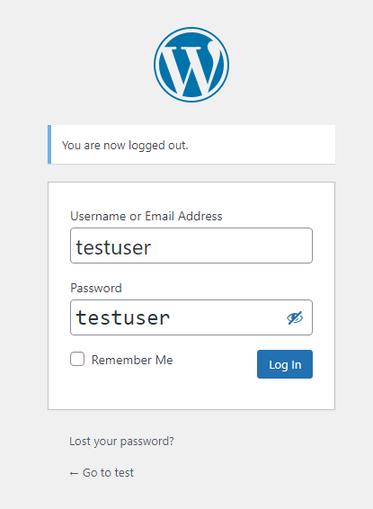

# Setup Wordpress

After setting up the docker, you can view the Wordpress homepage at port 8080.
 
http://[[HOST_SUBDOMAIN]]-8080-[[KATACODA_HOST]].environments.katacoda.com/wp-login.php
 

First, we need to set up the webpage
 
## Choose language
Choose your own language as the webpage language.

## Register 
Fill in the information like the following:

username: testuser
 
password: testuser
 
email: testuser@test.com
 

## Login
You can login the webpage by
Username:`testuser`{{copy}}
Password:`testuser`{{copy}}

# Plugin: Woocommerce

Go to Plugin and Add New to install the plugin.

 
Fill in the following information to set up the store

    

Select fashion, apparel and accessories as industry

 
Select Physical products as product to sell

 
Set 11-100 as number of product

 
Select the default theme as you like

## Create user
After that, we need to create a new user to browse the store.
 
Go to User and Add New to create a new user.

The list of user is shown below.

Yeah! We finished the setting finally!

