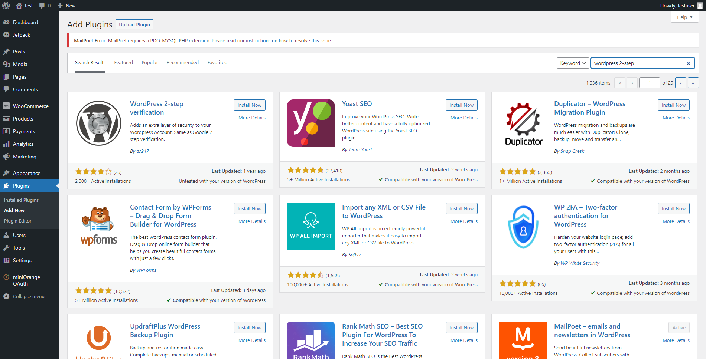
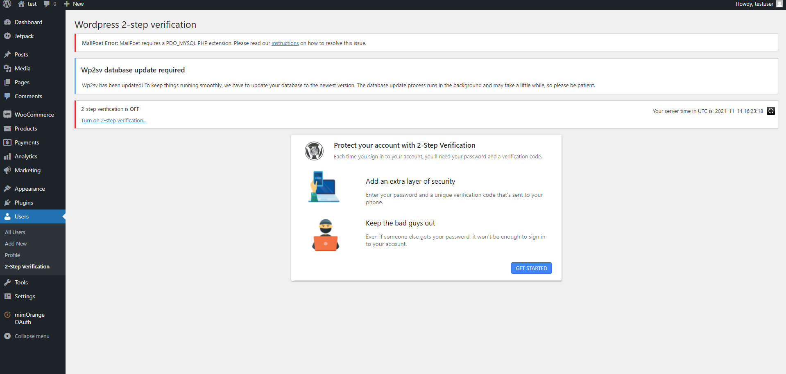
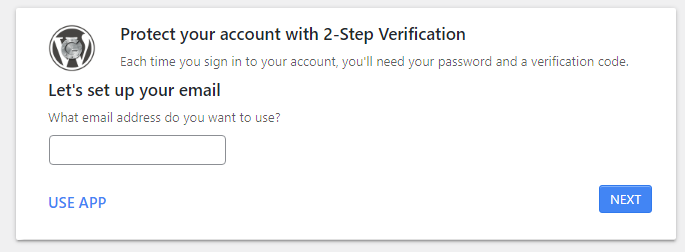
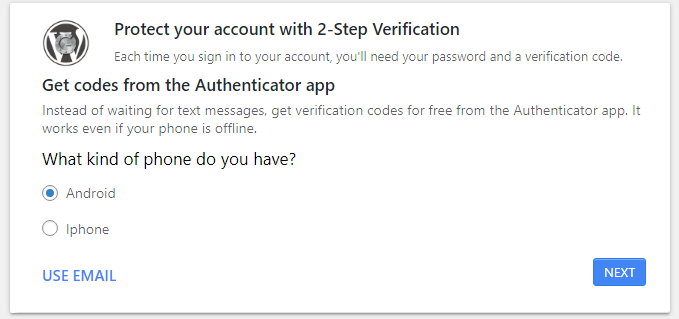
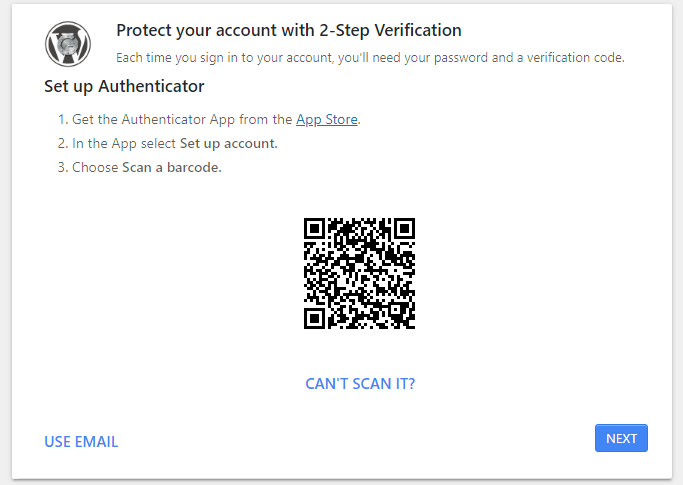
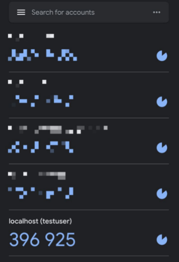
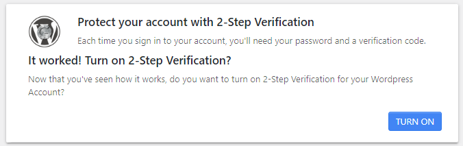
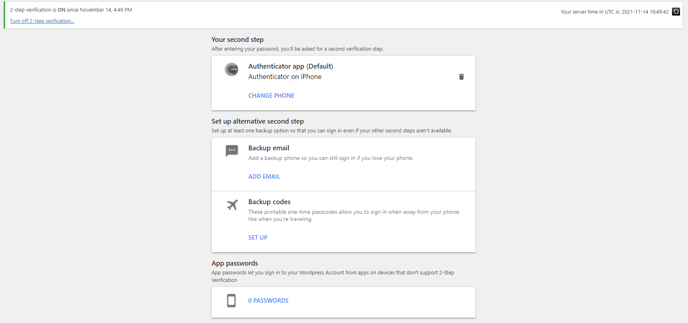
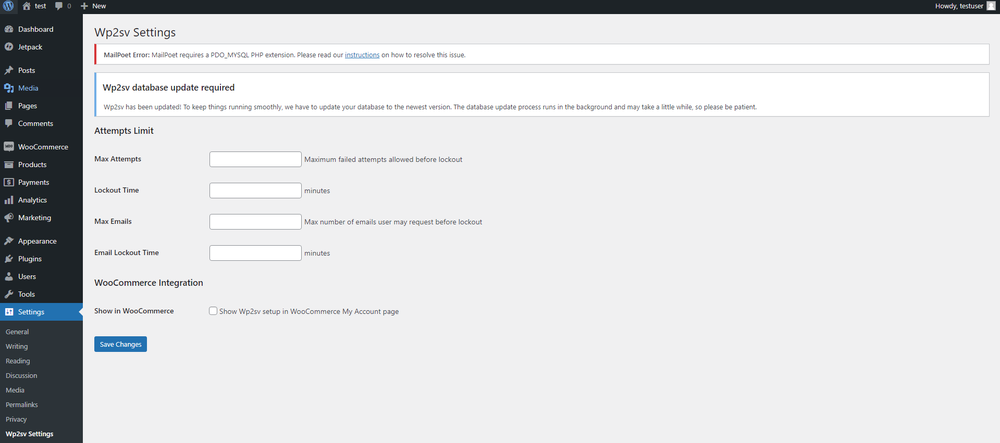
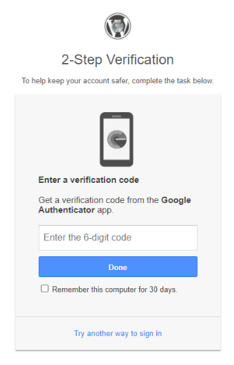

#Start set up attack prevention  
Finally, we are going to set up some plugins for attack prevention.
 
Now, the major authentication method is Password. But this is not save enough. Once the password is leaked, attacker can take the information of server easily. So, we need to set up the system be securer.

# Plugin: Wordpress 2-step verification
Go to Plugin and Add New to install the plugin.

After activating the plugin, go Users and 2-step Verification to set up.
Press GET STARTED to choose your verification method.

There are two ways to set up.
1. Email

2. Authenticator app
   
   You can choose Android or iPhone that you have.
   
   First, get the Authenticator App from the App Store.
    
   Then, In the App select Set up account.
    
   Third, Choose Scan a barcode. Scan the QR code using your phone.
    
   You may see the verification code in the App.

   

   After insert the code, you may see this message if it is worked. Press TURN ON to turn on the plugin.
   

   Then, you will see the status change from OFF to ON.
   

#Wordpress 2-step verification Setting
You can set up the Attempts Limit by filling in the number.

#Login with Wordpress 2-step verification
When you login again, you need to enter the 6-digit code to verify your identity.

   
